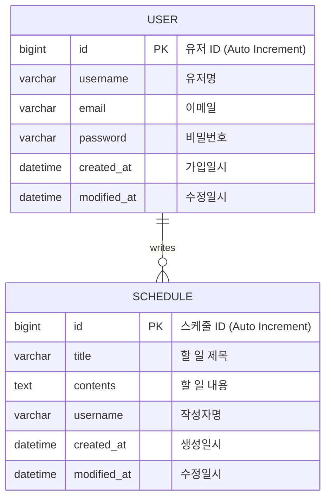

# 📅 일정 & 유저 관리 API (Schedule & User Management System)

Spring Boot와 JPA를 기반으로 구현된 일정(Schedule) 및 회원(User) 관리 백엔드 API입니다.
회원가입, 로그인 기능과 일정을 생성, 조회, 수정, 삭제하는 CRUD 기능을 제공합니다.

## 🛠 Tech Stack

- **Java**: 17
- **Spring Boot**: 3.x
- **JPA (Spring Data JPA)**: ORM
- **Database**: H2 / MySQL

## 📊 ERD (Entity Relationship Diagram)



## 📝 API 명세서 (API Specification)

### 1. 일정(Schedule) 관리

**Base URL:** `/jpas`

| 기능 | Method | URL | 설명 |
| :--- | :---: | :--- | :--- |
| **일정 생성** | `POST` | `/jpas` | 새로운 일정을 생성합니다. |
| **전체 조회** | `GET` | `/jpas` | 등록된 모든 일정을 조회합니다. |
| **단건 조회** | `GET` | `/jpas/{scheduleId}` | 특정 ID의 일정을 조회합니다. |
| **일정 수정** | `PATCH` | `/jpas/{scheduleId}` | 일정의 제목(Title)을 수정합니다. |
| **일정 삭제** | `DELETE` | `/jpas/{scheduleId}` | 일정을 삭제합니다. |

---

#### 1-1. 일정 생성 (Create Schedule)
- **URL:** `POST /jpas`
- **Request Body (JSON)**
```json
{
  "title": "알고리즘 스터디",
  "contents": "매주 월요일 저녁 8시 줌 미팅",
  "username": "developer_kim"
}
```
- **Response (201 Created)**
```json
{
  "id": 1,
  "title": "알고리즘 스터디",
  "contents": "매주 월요일 저녁 8시 줌 미팅",
  "username": "developer_kim",
  "createdAt": "2024-02-13T10:00:00",
  "modifiedAt": "2024-02-13T10:00:00"
}
```

#### 1-2. 일정 전체 조회 (Get All Schedules)
- **URL:** `GET /jpas`
- **Response (200 OK)**
```json
[
  {
    "id": 1,
    "title": "알고리즘 스터디",
    "contents": "매주 월요일 저녁 8시 줌 미팅",
    "username": "developer_kim",
    "createdAt": "...",
    "modifiedAt": "..."
  },
  {
    "id": 2,
    "title": "운동하기",
    "contents": "헬스장",
    "username": "fitness_king",
    "createdAt": "...",
    "modifiedAt": "..."
  }
]
```

#### 1-3. 일정 수정 (Update Schedule)
- **URL:** `PATCH /jpas/{scheduleId}`
- **설명:** 현재 로직상 `title` 필드만 수정됩니다.
- **Request Body (JSON)**
```json
{
  "title": "알고리즘 스터디 (시간 변경)",
  "contents": "내용은 수정되지 않습니다",
  "username": "작성자도 수정되지 않습니다"
}
```
- **Response (200 OK)**
```json
{
  "id": 1,
  "title": "알고리즘 스터디 (시간 변경)",
  "contents": "매주 월요일 저녁 8시 줌 미팅",
  "username": "developer_kim",
  "createdAt": "...",
  "modifiedAt": "2024-02-13T12:00:00"
}
```

#### 1-4. 일정 삭제 (Delete Schedule)
- **URL:** `DELETE /jpas/{scheduleId}`
- **Request Body (JSON):** (컨트롤러에서 요청 객체를 받도록 설정되어 있음)
```json
{
  "password": "1234"
}
```
- **Response (204 No Content)**

---

### 2. 유저(User) 관리

**Base URL:** `/users`, `/signup`, `/login`

| 기능 | Method | URL | 설명 |
| :--- | :---: | :--- | :--- |
| **회원가입** | `POST` | `/signup` | 신규 유저를 등록합니다. |
| **로그인** | `POST` | `/login` | 이메일과 비밀번호로 로그인합니다. |
| **유저 전체 조회** | `GET` | `/users` | 모든 유저 정보를 조회합니다. |
| **유저 단건 조회** | `GET` | `/users/{userId}` | 특정 유저 정보를 조회합니다. |
| **유저 정보 수정** | `PUT` | `/users/{userId}` | 유저 이름을 수정합니다. |
| **유저 삭제** | `DELETE` | `/users/{userId}` | 유저를 삭제합니다. |

---

#### 2-1. 회원가입 (Sign Up)
- **URL:** `POST /signup`
- **Request Body (JSON)**
```json
{
  "username": "홍길동",
  "email": "hong@example.com",
  "password": "password123"
}
```
- **Response (201 Created)**
```json
{
  "id": 1,
  "username": "홍길동",
  "email": "hong@example.com",
  "createdAt": "2024-02-13T10:00:00",
  "modifiedAt": "2024-02-13T10:00:00"
}
```

#### 2-2. 로그인 (Login)
- **URL:** `POST /login`
- **Request Body (JSON)**
```json
{
  "email": "hong@example.com",
  "password": "password123"
}
```
- **Response (200 OK)**
    - 성공 시 별도의 Body 없이 HTTP Status 200 반환 (세션 방식)

#### 2-3. 유저 정보 수정 (Update User)
- **URL:** `PUT /users/{userId}`
- **Request Body (JSON)**
```json
{
  "username": "홍길동(개명)"
}
```
- **Response (200 OK)**
```json
{
  "id": 1,
  "username": "홍길동(개명)",
  "email": "hong@example.com",
  "createdAt": "...",
  "modifiedAt": "..."
}
```
